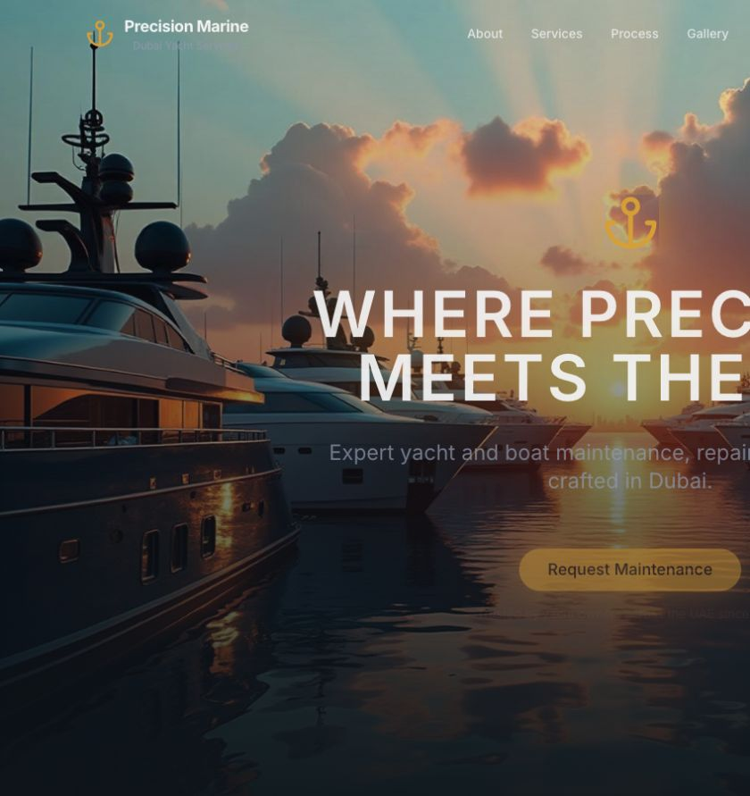

# Owner Review Pack — Michael Marine Foundation Draft

Status: **Draft, unmerged and not deployed to production**.

## Review identity

- Pull request: `saber93/dubai-marina-glow#2`
- Reviewed application head: `f0bf92bfd43dcb22c079775431405c0f9c8e31ad`
- Branch: `agent/phase0-foundation`
- Base: `main`
- Deploy Preview: `https://deploy-preview-2--michael-maintenance.netlify.app/`
- Baseline evidence: `BASE-TECH-001` / `PHASE0-ARCHIVE-MICHEALMARINESERVICES-COM-20260714`

The reviewed application head above is the exact foundation implementation. The later documentation-only commit that adds this pack and screenshots is recorded as the PR head in the PR description.

## Complete changed-file list

- `.github/workflows/quality.yml`
- `.gitignore`
- `.nvmrc`
- `AGENTS.md`
- `docs/OWNER_REVIEW_PACK.md`
- `docs/PHASE0_FOUNDATION_REPORT.md`
- `docs/owner-review-assets/homepage-desktop.png`
- `docs/owner-review-assets/homepage-mobile.png`
- `eslint.config.js`
- `netlify.toml`
- `package-lock.json`
- `package.json`
- `scripts/seo-check.mjs`
- `src/components/ui/command.tsx`
- `src/components/ui/textarea.tsx`
- `src/data/services.ts`
- `src/seo/route-manifest.ts`
- `tailwind.config.ts`
- `tests/route-manifest.test.ts`

## Visible claim review

- Removed visible claims: none.
- Softened visible claims: none.
- Retained claims: all current homepage copy, brand, contact controls, service summaries, project/testimonial content and media remain unchanged baseline source content.
- Evidence status: the baseline archive proves what production displayed; it does not approve the visible brand/legal identity, qualifications, awards, certifications, experience, project totals, ratings, testimonials, response times, guarantees, contact facts or media rights.

No identity or claim cleanup is included because those approvals remain unresolved.

## Metadata, H1 and schema

- Homepage title, meta description, H1 and rendered copy are unchanged.
- Existing canonical behavior and JSON-LD are unchanged; the preview observation still found no canonical link on the homepage.
- No Organization identity fields or new schema were added.
- The new SEO checker records baseline requirements; it does not rewrite output.

## Routes, sitemap, redirects and links

- Current homepage owner: one direct `200`, unchanged.
- Source-defined inner routes: exactly 20 records, all governance-only and blocked from restoration.
- Full preview crawl: all 20 source-defined inner routes return real `404`; an unknown route also returns real `404`.
- Sitemap: `1 → 1`, containing only `https://michealmarineservices.com/`.
- `robots.txt`: unchanged production sitemap reference.
- Redirects: `0 → 0` added.
- Consolidations: `0 → 0` approved or implemented.
- Cross-network selectors/editorial links: none added or removed.

The rendered homepage currently links to 13 of the blocked service routes; those 13 return the expected real `404`. The other seven source-defined blog/project routes also remain `404` when checked directly. This is recorded as an unresolved baseline usability issue and is not repaired without individual route ownership, claims and media approval.

## Media and visual evidence

- No production media file, URL, alt text or placement changed.
- Media rights remain unresolved for every current visual asset.

Desktop preview:

Mobile preview:

| Capture | Bytes | SHA-256 |
|---|---:|---|
| Desktop, 1440 × 900 | 68,570 | `1ecbd00e8ec114e6f2fca553c566e3acc48f1b16d6728ec0938948481e2b48c7` |
| Mobile, 390 × 844 | 22,456 | `b76c826a79bb7d1fe058ea17fe193237d06de47b89394707e63e98038561fe85` |

## Quality state

Passed on the reviewed implementation head with Node `24.18.0` and npm `11.16.0`:

- `npm ci`
- `npm run lint` — zero warnings
- `npm run typecheck`
- `npm test` — 5 tests
- `npm run build`
- `npm run seo:check`
- `npm audit --omit=dev` — zero vulnerabilities
- `git diff --check`
- GitHub Quality
- Netlify Deploy Preview and representative crawl

## Unresolved owner decisions and evidence

- Approve the exact legal/business identity behind the visible `Precision Marine Services` brand.
- Approve or remove every qualification, award, certification, experience, project-total, rating, testimonial, response-time and guarantee claim.
- Approve media ownership and allowed surfaces.
- Approve each of the 20 route owners individually before restoration or sitemap membership.
- Search Console Page Indexing and Links remain accepted point-in-time `processing` evidence. No repeat capture or Search Console write is required or authorized now.

## Production unchanged confirmation

Netlify still reports production deploy `6a567f126c6d480008205afb` as current and ready. The public sitemap remains homepage-only. This Draft exists only at its Deploy Preview. No production deploy, route restoration, sitemap expansion, redirect, consolidation, Search Console write, analytics activation, `hreflang`, authority asset or editorial network link occurred.
